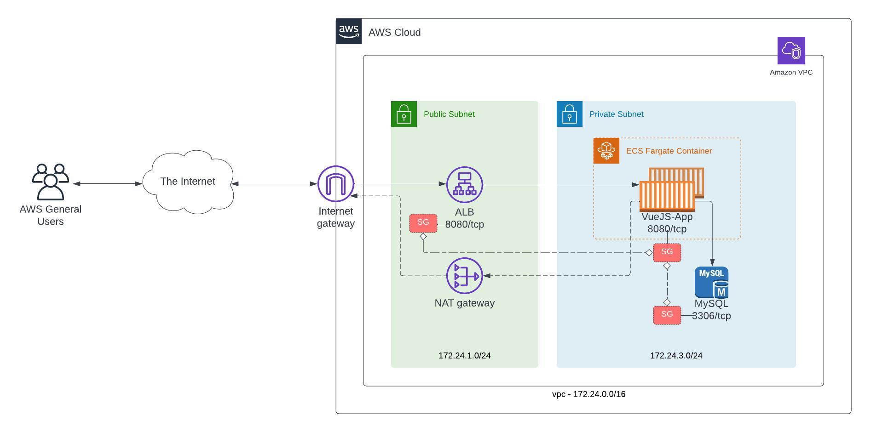

# NBC.Vue.Express.Node.MySQL.Infra
An e2e IaC pipeline built using Terraform to bootstrap AWS ECS Infra with ALB and MySQL RDS.

# Architecture



## Instruction to deploy the stack

1. Provide the following input variables.

```javascript
* vpc_cidr_block
* public_subnet_a_cidr_block
* public_subnet_b_cidr_block
* private_subnet_a_cidr_block
* private_subnet_b_cidr_block
* database_name
* database_username
* database_password
* database_identifier
```
2. Initialize the project and deploy from terminal
```javascript
terraform init
terraform plan -out=terraform.plan
terraform apply terraform.plan
```
3. Initialize the project and deploy from CI/CD
```javascript
terraform init
terraform plan -out=terraform.plan
terraform apply -input=false terraform.plan
```
4. Capture the outputs from the deployed stack to access the environment and configure the app
```javascript
aws_ecs_cluster = "ecs_clustername"
aws_ecs_service = "ecs_clustername"
loadbalancer_url = "alb.region.elb.amazonaws.com"
rds_endpoint = "rds.region.rds.amazonaws.com:3306"
```
# Commit message format for Semantic Release

Semantic-release uses the commit messages to determine the type of changes in the codebase. Following formalized conventions for commit messages, semantic-release automatically determines the next semantic version number, generates a changelog and publishes the release.

## Must be one of the following:

| Commit Message [MAJOR]                                                  | ReleaseType     | Format |
| ------------------------------------------------------------------------|:---------------:| ------:|
| **feat:** Adding new feature with major changes                         | Major Release   | 1.0.0  |
| ***BREAKING CHANGE:*** Adding this changes will improve performance     |                 |        |


| Commit Message [MINOR/FEATURE]                                          | ReleaseType     | Format |
| ------------------------------------------------------------------------|:---------------:| ------:|
| **feat:** Added new features                                            | Feature Release | 0.1.0  |
| **fix:** fixed some bugs                                                | Patch Release   | 0.0.1  |
| **perf:** Performance Improvements changes                              | Patch Release   | 0.0.1  |
| **test:** Adding missing or correcting existing tests                   | Patch Release   | 0.0.1  |
| **docs:** Documentation only changes                                    | Patch Release   | 0.0.1  |
| **refactor:** A code change that neither fixes a bug nor adds a feature | Patch Release   | 0.0.1  |
| **chore:** Changes to the build process or auxiliary tools and libraries| Patch Release   | 0.0.1  |